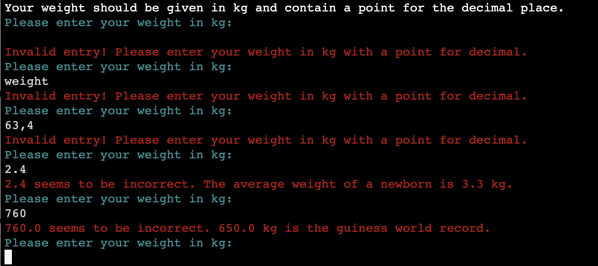
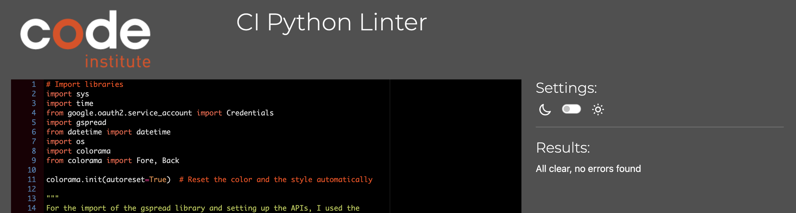
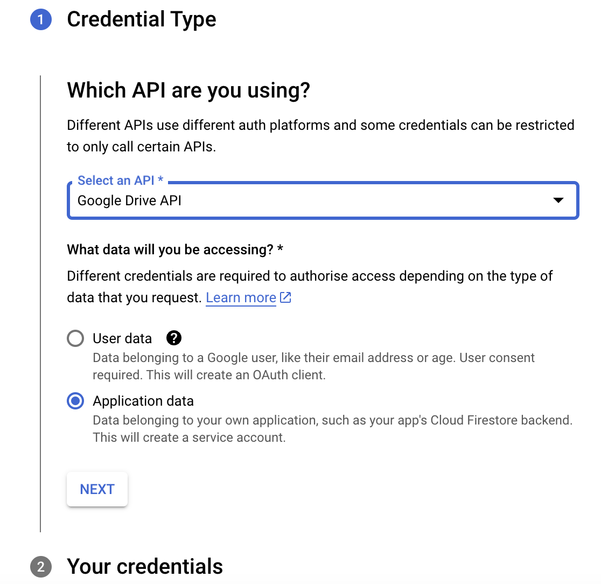

# Your Life in Numbers

Python Essentials Project Portfolio - Code Institute

View deployed site [here.](https://queenisabaer.github.io/life-in-letters/) 

 *Your Life in numbers* is a command-line interface program whose main goal is to provide the user with some facts based on the user's age, gender(GAAB/Current physical sex), height and weight. Upon receiving the user's input, the application presents/calculates the specified information regarding the chosen topic. Subsequently, the user has the option to either switch to the other topic, or exit the application. 

 

## Table of contents

- [User Experience (UX)](#user-experience)
- [Design](#design)
- [Features](#features)
- [Technologies Used](#technologies-used)
- [Testing](#testing)
- [Deployment](#deployment)
- [Credits](#credits)

## User Experience (UX)

### User stories

*Your Life in numbers* is for those who are interested in statistics about health topics and trivial facts around the age, weight and height of a human. 

As owner of the application:

- I want to build an application that allows users to learn more about their own BMI, their RMR (Resting Metabolic Rate) and some age-related topics. 
- I want to ensure that the user interface remains consistent across all features to make it easy to use and navigate through.
- I want the application to provide clear instructions and have an intuitive design to ensure that the user receives all the information necessary for the correct use of the application.
- I expect the application to offer feedback to users during their interactions, guiding them through the input process.
- I want to ensure the reliability of the application by implementing input validation mechanisms to avoid user errors and minimize the risk of technical problems or data inaccuracies. 

As visitor/user of the application:

- I want to easily understand what the purpose and the benefits of the program are.
- I want the application to provide clear instructions on how to use its features.
- I want the application to guide me through the process of entering my personal information, and expect the application to provide instant feedback to ensure that I provide accurate data.
- I want to know what my data is used for. 
- I want the interface to be visually appealing with concise explanations.
- I want to know more about some statistics and calculations around my life. 

## Design

- **Imagery:** 
  No images can be used in the terminal itself. The only way to display some kind of pictures is by using ASCII Art. I created the logo for _Your Life in Numbers_  by using the font "Small Keyboard" with this [ASCII Art Generator](https://patorjk.com/software/taag/#p=display&f=Graffiti&t=Type%20Something%20) that creates ASCII Art from text. 

   

  The background image was selected as a contrast to the terminal. The arrangement of the numbers in a spiral-like pattern makes it a perfect match for the subject of the application. 

- **Colour Scheme:** 
  The colour choices were limited, since this application is terminal-based. My main goal with my colour scheme was therefore to provide feedback to the user and give the application some structure and consistency. To add the colours for the project, I used [Python Colorama](https://pypi.org/project/colorama/)
 I made the following colour selection from Colorama:

  - GREEN  
    
  >  **Green** is the color most commonly associated with nature, **life**, **health**, youth, spring, hope, and envy. _(Wikipedia)_

  I used green for the logo of the application because it covers the topics of life and health. 
  Furthermore, it was used to show a positive message after a correct input by the user.  
  
  - RED  
    
  > Since **red** is the color of blood, it has historically been associated with sacrifice, **danger**, and courage. _(Wikipedia)_

  Red was used to display a negative message respectively a warning if the user's input was invalid.  

  - CYAN  
    
  > **Cyan** [...] is typically associated with liveliness, youth and **energy**, [...]. _(Designs.ai)_

  Cyan was used to query the user input. Since it is the colour between blue and green it was perfect for the user questions, which must be valid(green in the application). The user's response and the calculated numbers can then be seen in blue.

  - BLUE  
    
    
  > **Blue** [...] often symbolizes serenity, **stability**, inspiration, or **wisdom**. _(Wikipedia)_

  The blue colour indicates the user's response and the calculated numbers in the topics. 

  - MAGENTA  
    
    
  > It _[**Magenta**]_ promotes compassion, support and kindness and encourages a sense of self-respect and contentment in those who use it. Physiologically magenta helps us to flow with life and let go of old ideas. It's associated with love, warmth and respect [...]. _(AZDESIGN)_

  Since data security is crucial to me, I used Magenta for the Disclaimer. It was also used for the headings of the topics. 

  - YELLOW  
    
    

  > **Yellow** is the colour people most often associate with amusement, **gentleness**, humor, **happiness**, and spontaneity [...]. _(Wikipedia)_
  
  Subheadings were labeled with yellow. The lighter version of yellow was used for the headline "ATTENTION" or the gender question. 

  - BLACK & WHITE  
   The Terminal has a black background with white text(except the statements above). 

 Click here to see the Colour palette 

 

The colour code for the colours in the terminal was taken by using the pipette function of [ColorZilla](https://www.colorzilla.com/de/chrome/welcome/new/?chrome/121.0.0.0/-/4.0). I created the colour palette with [coloors](https://coolors.co/) 
 
 

### Flowchart

The flowchart was crafted during the planning phase of the project and was created with [Lucid](https://lucid.app/). It still displays a third topic(Food/Drinks), that I would love to implement in the future. Furthermore, it has some additional input (smoking/alcohol) that I didn't use in the end. This would also be a feature for the future.

 Click here to see the flowchart 

 

## Features

### Existing Features

To learn more about each feature, please click on the respective headline

 Logo 'Your Life in Numbers' 

 

The logo for the application was created with an [ASCII Art Generator](https://patorjk.com/software/taag/#p=display&f=Graffiti&t=Type%20Something%20) (Font: Small Keyboard).
Unfortunately, the ASCII Art created a warning of "invalid escape sequence". To fix this issue I used a blog post by [Adam Johnson](https://adamj.eu/tech/2022/11/04/why-does-python-deprecationwarning-invalid-escape-sequence/) 
 
The logo was designed for the welcome panel and is displayed again each time the application deletes the terminal from the previous entries. The only exception is the ending of the app. 

 Disclaimer 

 

The disclaimer outlines the data management process of the application. It assures users that their data is stored temporarily during the program's use in a Google spreadsheet but will be deleted automatically once the program is exited correctly. Since the data that the user must provide to run the application properly is sensitive, the program seeks user confirmation to proceed, giving them the option to continue or decline.  
 
If the confirmation is negated, the program is immediately terminated. 
 
If a user does not answer and clicks "enter" right away or types a number respectively a letter other than y or n, an error message appears, indicating that only y or n can be entered. 

 Google Spreadsheet 

 

As soon as a user confirms the disclaimer, the existing worksheet 'user' is copied into the Google spreadsheet 'life-in-numbers-secure'. (See also: _Existing feature_ > _Input Validation_ > _1. Disclaimer_) Sensitive data should not normally be stored in a worksheet. Currently, however, the use of external databases is still beyond my capabilities. I therefore decided to use this somewhat unusual method of copying and automatic deletion. 

 

In order for the worksheet to be uniquely assigned to the user, the new worksheet is given a non-recurring name by adding a time stamp to it. 

 

All data entered by the user is stored in this new created worksheet.(See also: _Existing Features_ > _Input Validation_ > _6. Weight_) This sheet also contains the age, which was calculated during the input display. The program uses this cell (f2) in later calculations and outputs.

 

If the program is terminated properly, this unique worksheet is automatically deleted.(See also: _Existing Feature_ > _Input Validation_ > _7. Topic question_)  

The user is informed at the very beginning that the application must be terminated properly to delete this data sheet. In a future feature I would like to create a batch cleanup for abandoned worksheets, if an error occurs or the user doesn't end the program properly.

**Notice:**  A presvious version of this README contained a link to the google spreadsheet. I realised that this link was on a public repository and the spreadsheet may contain sensitive information. I deleted this link and switched in the code to a new hidden spreadsheet, because the original link is still in my commit history. Many of the screenshots in the readme are still with the old version of the spreadsheet, but the functionality is the same with the new version as well. 

 Input Validation 

 

In the course of the application, there is a variety of different inputs that the user must make. Since this involves different types of data, such as year of birth, name or weight, the validations also had to be adapted accordingly. 

1. **Disclaimer** (y/n)  
The first input validation can also be seen in the existing feature _Disclaimer_. The program requires user confirmation at the beginning before proceeding, giving them the option of continuing by typing _y_ or declining by entering _n_. An error message appears if a user does not answer and clicks 'enter' immediately or types a number or a letter other than y or n. 
 
If a user refuses to consent, the program will be terminated immediately within a few seconds.  
 
As soon as the user agrees to the conditions by entering y, a new unique worksheet is created and the query of the data begins. 
 

2. **Name**  
The user must make an entry, but this entry should not exceed 15 characters and must not contain special characters, numbers, or spaces.
 
If the name does not start with a capital letter, it is automatically capitalized by the program(see blue name in the greeting) 
 

3. **Birth year** 
The user must make an entry. The year of birth should not contain spaces or letters and must be exactly 4 numbers long. In addition, the year of birth must be within a reasonable range. As a guideline, the current year and the oldest person according to Guinness World Record was used here as limitation. 
 
As soon as the user enters a year of birth within the permitted range, it is confirmed and the screen is cleared.
 

4. **Gender(GAAB/CPS)** 
The question of gender is a particularly sensitive one. I have therefore included a note explaining that this statement must be made because some calculations are based on gender. I tried to explain that the limited options here are just due to the nature of the application but that they are not meant to exclude or discriminate.  
 
An error message appears if a user does not answer and clicks 'enter' immediately, types a number or a letter other than f or m  
 
As soon as the user has typed f or m, he receives a confirmation that this input can be used and the next question (height) is displayed.  
 

5. **Height**  
The user must provide a height specification (with a point for decimal), which must be within a reasonable range (minimun is the average height of a newborn and maximum is guinness world record). Otherwise, an error message is displayed.
 
The next question(weight) is displayed after a valid entry is confirmed.
 

6. **Weight**  
The user must provide his weight (with a point for decimal), which must be within a reasonable range (minimun is the average height of a newborn and maximum is guinness world record). Otherwise, an error message is displayed.
 
As soon as the user has made a valid entry, a positive confirmation is displayed and in the background the worksheet is automatically updated. 
 

7. **Topic question**  
After all data has been entered correctly and the worksheet has been updated, the user is shown the possible topics.  
 
An error message appears if a user does not answer and clicks 'enter' immediately, types a letter or a number other than 1, 2 or 3. 
 
At this point it is possible to exit the application and delete the data from the spreadsheet.  

8. **Other topic question (y/n)**  
After the user has decided on a topic, he is asked if he also wants to learn something about the other topic. Again, he has the opportunity to end the program.  
An error message appears if a user does not answer and clicks 'enter' immediately, types a letter or a number other than y or n. 

When the user enters n, a short farewell message is displayed in which the user’s name is used. In addition, the screen is cleared after 5 seconds and the worksheet is deleted. 

 Display of the entered data 

 

After the user has entered all data correctly and the worksheet has been updated, the user will be shown his entries again. The data from the worksheet is used for this purpose. 
At this point, I would like to include in the future the possibility that the user can change his data again.  
 

 Topic HEALTH 

 

If the user has selected the topic _Health_ by pressing 1 in the topic question(see also: _Existing Feature_ > _Input validation_ > _7. Topic question_), the screen is deleted and the logo is displayed again. Then the BMI, the life expectancy in weeks and finally the RMR is shown. The calculated numbers are displayed in blue. After the calculations the user has the option to either quit the program or learn about the other topic _Trivia_ 
 
While I was writing the README, I noticed that in the second function for the topic _Health_, I did not use parameters, but only variables. So I created a test python file to see if the code will still work correct if I insert the parameters. After doing this successfully, I copied the entire code from the test file and replaced the existing code so as not to forget a value. I know that this is clearly not best practice, because of course the commits for this step can no longer be traced well. I have therefore decided to mention this here at least in the README. Nevertheless, now the class User is used uniformly for all parameters in the function health. 

1. **BMI**  
Body Mass Index (BMI) is a person's weight in kilograms divided by the square of height in meters. The grading within the individual classes(e.g. underweight, normal weight etc.) according to gender was taken from a German blog: [Rezeptrechner](https://www.rezeptrechner-online.de/blog/bmi-tabelle-rechner/) The calculator can only be used for adults, 20 years old and older. The BMI for children and teens is slightly different and is given in percentiles. I would like to add this feature in the future. 

2. **Years and Weeks**  
The average life expectancy of men and women was found on the [database earth](https://database.earth/population/europe/life-expectancy). These numbers and the age of the user are the basis for the calculations carried out at this point.  

3. **RMR**  
The Resting Metabolic Rate(RMR) was calculated with the Mifflin-St Jeor Equation:  
Men: (10 × weight in kg) + (6.25 × height in cm) - (5 × age in years) + 5.  
Women: (10 × weight in kg) + (6.25 × height in cm) - (5 × age in years) - 161.  
It was found at the [NASM Blog](https://blog.nasm.org/nutrition/resting-metabolic-rate-how-to-calculate-and-improve-yours). I could not assign a variable to the given numbers(e.g. 10, 6.25) because I did not find the exact assignment. 

 Topic TRIVIA 

 

If the user has selected the topic _Trivia_ by pressing 2 in the topic question(see also: _Existing Feature_ > _Input validation_ > _7. Topic question_), the screen is deleted and the logo is displayed again. After that, a birthday greeting, age in dog years and age on different planets will be displayed. The calculated numbers are displayed in blue. After the calculations the user  has the option to either quit the program or learn about the other topic _Health_. 
 

In order to perform the calculations for the topic _Trivia_, a variable was created, which refers to the value 'Age' from the worksheet. This should show that I can also use concrete data from the spreadsheet. 

1. **Happy Birthday**  
This is a simple birthday greeting.  

2. **Dog Years** 
How to calculate a humands age intodog years was found at the website of tehe [American KennellClub](https://www.akc.org/expert-advice/health/how-to-calculate-dog-years-to-human-years/). As a general guideline it can be broke down like this: 
> - 15 human years equals the first year of a medium-sized dog’s life.  
> - Year two for a dog equals about nine years for a human.  
> - And after that, each human year would be approximately five years for a dog. _(American Kennell Club)_  

 Program ending 

 

xxx 

### Features, which I would like to implement in the future

- I want to implement a login option so that the user can create an account and return to the application to view and update their data. 
- I want to create more topics, like food/drinks. In this category, you could find some information about the average consumption of certain foods(e.g. vegetables, meat, etc.) per life or year.
- I want to add some input requirements for habits such as smoking or alcohol consumption. This data could be used to adjust some of the calculations, such as life expectancy. In addition, the application could show how a change in this habit would be noticeable in the numbers. 
- I want to add a batch cleanup of abandoned worksheets (e.g. every night at 1pm or once a week at 12am). Because right now I have to regularly check if a user didn't end the application properly or an error has occured and the spreadsheet still contains abandoned worksheets. 
- I would like to add the BMI equivalent for people under 19. 

## Technologies Used

- [HTML5](https://en.wikipedia.org/wiki/HTML5)/ [CSS]()
- [Python](https://en.wikipedia.org/wiki/Python_(programming_language))
- [Git](https://git-scm.com/) was used for version control by utilizing the Gitpod terminal to commit to Git and Push to GitHub.
- [GitHub](https://github.com/) was used to save and store the files for the website.
- [Heroku](https://www.heroku.com) was used to deploy the application.
- [Lucid](https://lucid.app/) was used to create the Flowchart.
- [CSS Gradient](https://cssgradient.io/) was used to create the gradient background of the instruction button
- [Black Formatter](https://marketplace.visualstudio.com/items?itemName=ms-python.black-formatter) to beautify the code
- [LanguageTool](https://languagetool.org/) was used to check the grammar and spelling in the README and the Code. 
- [Colorama](https://pypi.org/project/colorama/) was used to color the text in the terminal.
- [Coloors](https://coolors.co/image-picker) was used to create the color scheme.
- [Pixelied](https://pixelied.com/convert/jpg-converter/jpg-to-webp) was used to convert jpg images into wepb images.
- [Tinypng](https://tinypng.com/) was used to compress the webp background-image.
- [Pixabay](https://www.pixabay.com/de-de/) was used to search and load the background image.
- [ASCII Art Generator](https://patorjk.com/software/taag/#p=display&f=Graffiti&t=Type%20Something%20) was used to create the logo.
- [Google Spreadsheet](https://docs.google.com/spreadsheets/u/0/?pli=1) was used to create the worksheet for the application.
- [QuickTime Player](https://support.apple.com/en_GB/downloads/quicktime) was used to create for recording the screen.
- [xconvert](https://www.xconvert.com/) was used to convert the screen recording from mov into gif.

## Testing

1. **Validator Testing**

- **[CI Python Linter](https://pep8ci.herokuapp.com/#)**

  - result for run.py 
  In the first run I had some warnings about trailing whitespace and errors about too long lines, but after fixing those, no more errors were found. 
     

- **[HTML Validator](https://validator.w3.org/)**

  - result for layout.html 
  Since I added a favicon, a meta description, a title and some style to the layout.html file, I did check the layout.html file with the [Nu Html Checker](https://validator.w3.org/nu/about.html). In the first run, it came back with an error for the CSS height in the style area because I added a space between the number and the unit. After deleting this space, it came back with no errors or warnings. 
   

2. **Lighthouse Test**  
   To measure the website against performance, accessibility, SEO and best practice, I used [Lighthouse](https://chromewebstore.google.com/detail/lighthouse/blipmdconlkpinefehnmjammfjpmpbjk?hl=de). 
   - result  
  Although I was told, that we don’t have to do a Lighthouse test, I still created one for the site, as I added a background image, among other things. 
  The 94% were caused by the background image and the border of the "Run Programm" button. I couldn’t improve accessibility further, but since this project wasn’t HTML/CSS first, I thought 94% was still a good result.
   

3. **Manual testing**  

| **Test** | **Test Description** | **Expected Outcome** | **Result** |
|:---|:---|:---|:---|
| Programm start | Open the link for the live website or click on the _Run Program_ button | As soon as the page is loaded or the _Run Program- button was clicked, the logo for the application and the Disclaimer should be displayed | Pass |
| Disclaimer - invalid input | Press _Enter_ key, type a number or a letter other than y or n and then press _Enter_ key | A warning/message that the user needs to make a correct input | Pass |
| Disclaimer - n input | Type n and press _Enter_ key | A farewell message is displayed and the program exits by clearing the screen. | Pass |
| Disclaimer - y input | Type y and press _Enter_ key | A positive confirmation is displayed and the program starts in the query of the data | Pass |
| Google Spreadsheet - new worksheet | Type y and press _Enter_ | In the Google spreadsheet, the existing user worksheet should be copied and given a unique name. | Pass |
| Google Spreadsheet - delete worksheet | Go to the end of the application and confirm the exit. | The created worksheet should be deleted automatically. | Pass |
| Name question - invalid input | Press _Enter_ key, type a number, a space, a special character or a name longer than 15 characters and then press _Enter_ key | A warning/message that the user needs to make a correct input should be displayed | Pass |
| Name question - valid input | Type a name and press _Enter_ key | A positive confirmation should be shown and the next question (year of birth) should be displayed. | Pass |
| Birth year - invalid input | Press _Enter_ key, type a letter, a space, a special character, enter more or less than four numbers or an age outside a reasonable range.(-116 years-current year) and then press _Enter_ key | A warning/message that the user needs to make a correct input is shown | Pass |
| Birth year - valid input | Type four numbers in the reasonable range and press _Enter_ key | A positive confirmation should be shown, the terminal should be cleared and the note about gender should be displayed. | Pass |
| Gender - invalid input | Press _Enter_ key, type a letter other than f or m, a space, a special character and then press _Enter_ key| A warning/message that the user needs to make a correct input is shown | Pass |
| Gender - valid input | Type f or m and press _Enter_ key| A positive confirmation should be shown and the next question(height) should be displayed | Pass |
| Height - invalid input | Press _Enter_ key, type a letter, a space, enter the height with a comma for decimal or a height outside a reasonable range.(0.49m-2.72m) and then press _Enter_ key | A warning/message that the user needs to make a correct input is shown | Pass |
| Height - valid input | Type the height inside the reasonable range with a point for decimal and press _Enter_ key| A positive confirmation should be shown and the next question(weight) should be displayed | Pass |
| Weight - invalid input | Press _Enter_ key, type a letter, a space, enter the weight with a comma for decimal or a weight outside a reasonable range.(3.3kg-650.0kg) and then press _Enter_ key | A warning/message that the user needs to make a correct input is shown | Pass |
| Weight - valid input | Type the weight inside the reasonable range with a point for decimal and press _Enter_ key| A positive confirmation should be shown and the worksheet should be updated | Pass |
| Display of entered data | Enter a valid weight and press the _Enter_ key | The data entered should be displayed to the user. | Pass |
| Topics question | Enter a valid weight and press the _Enter_ key | The data entered should be displayed to the user, then the screen is cleared, the logo is displayed again and the topics question is loaded | Pass |
| Topics question - invalid input | Press _Enter_ key, type a letter, a space or a number other than 1, 2 or 3 and then press _Enter_ key | A warning/message that the user needs to make a correct input is shown | Pass |
| Topics question - valid input: 1 | Type 1 and press _Enter_ key| The screen should clear and then the logo and topic _health_ should be displayed with BMI, life expectancy and RMR | Pass |
| Topics question - valid input: 2 | Type 2 and press _Enter_ key| The screen should clear and then the logo and topic _trivia_ should be displayed with Happy Birthday, dog years and celestial age | Pass |
| Topics question - valid input: 3 | Type 3 and press _Enter_ key| A farewell message should be displayed and the message that the program will quit in the next 5 seconds. At the same time, the worksheet should automatically delete itself. | Pass |
| Next topic question - invalid input | Press _Enter_ key, type a letter, a space or a number other than y or n and then press _Enter_ key | A warning/message that the user needs to make a correct input is shown | Pass |
| Next topic question - valid input: y | Type y and press _Enter_ key| The screen should clear and then the logo and the other topic should be displayed | Pass |
| Next topic question - valid input: n | Type n and press _Enter_ key| A farewell message should be displayed and the message that the program will quit in the next 5 seconds. At the same time, the worksheet should automatically delete itself. | Pass |

4. **Browser Compatibility** 
  The tests were conducted using the following browsers:

- Google Chrome Version 120.0.6099.129
- Safari on Mac Version 17.0 (17616.1.27.111.22, 17616) 
- Safari on iOS 17.2.1
- Edge Version 120.0.2210.61

5. **Bugs**

- 

## Deployment

### Heroku
This site is deployed using Heroku. To deploy it from its GitHub repository to Heroku, I took the following steps:

1. Create a list of requirements in the requirements.txt file by using the command _pip3 freeze > requirements.txt_
2. Log in (or sign up) to Heroku
3. Click on the _New_ button and select _Create new app_
4. Give it a unique name and choose the region _Europe_
5. Click the *Settings* tab, go to the _Config Vars_ section and click on the _Reveal Config Vars_ button
6. Copy the content of the creds.json file() and paste it into the value field, then name the _Key_ CREDS, like the variable that holds the json file in the run.py file
7. Click the _Add_ button
8. Add a second key _PORT_ and set the value to _8000_
9. Go to the _Buildpacks_ section and click the _Add Buildpacks_ button
10. Select _python_ and click the _Save changes_ button
11. Add a second buildpack: _nodejs_
12. Click the *Deploy* tab, go to the _Deployment method_ section, select _GitHub_ and confirm this selection by clicking on the _Connetc to Github_ button
13. Search for the respository name on github _life-in-numbers_ and click the _Connect_ button 
14. Enable the automatic deploy or manually deploy the code from the main branch. 

To see the [view of the live site](https://life-in-numbers-8fabeba9f5dd.herokuapp.com/) click on the _Open app_ button on the top right corner or, if you enabled automatic deploy(step 14), log in to GitHub, navigate to the repository for this project by selecting [*queenisabaer/life-in-numbers*](https://github.com/queenisabaer/life-in-numbers), click on _Deployment_ and choose in the _Environments_ section _life-in-numbers_. On top of the latest deployment is the link to the [live site](https://life-in-numbers-8fabeba9f5dd.herokuapp.com/).

### Forking this GitHub repository
1.  Log in to GitHub.
2.  Navigate to the repository for this project by selecting [*queenisabaer/life-in-numbers*](https://github.com/queenisabaer/life-in-numbers)
3. Click at the top of the repository on the **Fork** button on the right side

### Clone this repository
1.  Log in to GitHub.
2.  Navigate to the repository for this project by selecting [*queenisabaer/life-in-numbers*](https://github.com/queenisabaer/life-in-numbers)
3. In the top right corner, click on the green *Code* button
4. Copy the HTTPS URL in the tab *Local*
5. Go to the code editor of your choice and open the terminal
5. Type `git clone` and paste the URL you copied into your terminal
6. Press the enter key

### Create a Google Spreadsheet(data model) and integrate it using API

*__Create the Google Spreadsheet__*
1. Log in (or sign up) to Google Account
2. Access [Google spreadsheet](https://docs.google.com/spreadsheets/u/0/?pli=1)
3. Create a new spreadsheet and give it a descriptive name, e.g. _'life-in-numers'_ like the name of the application
4. Rename the worksheet (e.g. _'user'_) and add, if neccessary, additional worksheets 
5. Add headings (_Name, Birth year, GAAB/CPS (m/f), Height in m, Weight in kg, Age_) 

*__Set up the APIs__*

1.  Navigate to the [Google Cloud Platform ](https://console.cloud.google.com/)
2. Create a new project by clicking the button _Select a project_ and then select _new project_ 
    

    
 View this step as screenshot

     

    
    

3. Give the project a descriptive and meaningful name, e.g. life-in-numbers and click on the _CREATE_ button 
    

    
 View this step as screenshot

     

    
    

4. In the Notifcations pop-up click on "SELECT PROJECT" 
    

    
 View this step as screenshot

     

    
    

5. On the project page go to the menu(click the burger icon in the top left corner of the page), click on _APIs and services_ and then select _Library_ 
    

    
 View this step as screenshot

     

    
    

6. In the search bar search for _Google Drive_ and enalbe it 
    

    
 View this step as screenshot

     

     
    
    

7. To conntect to this API, you need to generate CREDENTIALS(proof to the google drive, that you have permission to access) by clicking on _Credentials_ in the sidebar and then select _+ CREATE CREDENTIALS_ -> _Help me choose_
    

    
 View this step as screenshot

     

     
    
    

8. In the _Credential Type_ section select _Google Drive API_ and Application Data and click on the _NEXT_ button 
    

    
 View this step as screenshot

     

    
    

9. Enter a costum service name and click the _CREATE AND CONTINUE_ button 
    

    
 View this step as screenshot

     

    
    

10. As role select _Editor_ in the Quick access section _Basic_ and press the _CONTINUE_ button 
    

    
 View this step as screenshot

     

     
    
    

11. The form fields in the next question: _Grant users access to this service account_ can be left blank, just click on the _DONE_ button 
    

    
 View this step as screenshot

     

    
    

12. Click on the mail from the new created Service Account 
    

    
 View this step as screenshot

     

     
    

13. Click on the Tab _KEYS_ and then select _Create new key_ from the dropdown menu of the _ADD KEY_ button 
    

    
 View this step as screenshot

     

    
    

14. The key type can stay as JSON, just click the _CREATE_ button. Then a json file will be downloaded in to your local maschine. 
    

    
 View this step as screenshot

     

    
    

15. Make sure that the json file is never committed to github, since it contains sensitive information. For this purpose, create a _.gitignore_ file in the workspace and add the name of the json file to it.
16. Go back to the library again (Step 5) and search for _google sheets api_ and enable it 
    

    
 View this step as screenshot

     

     
    
    

17. Drag and drop the credential-json file, that was downloaded after step 14, into the workspace and rename it as _creds.json_(for simplicity reasons)
18. Open the json file in the workspace and copy the _client mail_ without the quotes
19. Go to the created Google Spreadsheet and click the _Share_ button
20. Paste in the mail adress(step 17), select _Editor_ and then click _Share_

*__Connecting the APIs to Python__*
1. In the workspace terminal command 'pip3 install gspread google-auth'.  
2. Import the gspread library on top of the python file in the workspace. 
3. Then import the _Credentials_ from the Google Auth Account (google.oauth2.service_account)
4. Set the _SCOPE_, that lists the APIs, the program needs to access in order to run.
5. Create _CREDS_, use the gspread authorize method and access the created worksheet data

## Credits

### Content

- The background image is from [pixabay by Gerd Altmann](https://pixabay.com/de/illustrations/zahlen-nummern-unendlichkeit-937884/)
- The average weight and height of a human baby was found [here](https://www.sueddeutsche.de/gesundheit/geburtsgroesse-das-neue-standardbaby-1.2124509), which includes this study from [the lancet](https://www.thelancet.com/journals/lancet/article/PIIS0140-6736(14)61490-2/abstract)
- The heaviest and tallest person were found on a list in [wikipedia](https://en.wikipedia.org/wiki/List_of_heaviest_people)
- The classification for the bmi was taken from [this site](https://www.rezeptrechner-online.de/blog/tag/bmi-tabelle-teenager/)
- The numbers for life expactancy in europe was found at the [database earth](https://database.earth/population/europe/life-expectancy)
- How to calculate the Resting Metabolic Rate was found [here](https://blog.nasm.org/nutrition/resting-metabolic-rate-how-to-calculate-and-improve-yours)
- How to calculate human years into dog years was found at [American Kennel CLub](https://www.akc.org/expert-advice/health/how-to-calculate-dog-years-to-human-years/)
- Examples of sidereal periods for the planets were found at [wikipedia](https://en.wikipedia.org/wiki/Orbital_period)
- How to calculate the personal age on another planet was from a pdf chart at [girlsstart](https://girlstart.org/wp-content/uploads/2017/07/13.Age-on-Planets.pdf)

### Code

- To import the gspread library, setting the APIs, update the worksheet and getting the data from this worksheet, I used the walkthrough project *love-sandwich* from Code Institute. 
- How to clear the screen was found in an article by [altcademy](https://www.altcademy.com/blog/how-to-clear-screen-in-python/), in the end I only used another print statement, that was given me by my mentor Brian Macheria. 
- To create a typewriting effect I used the tutorial by [101computing](https://www.101computing.net/python-typing-text-effect/)
- Although I didn't use this function in the end(but can still be seen on the easrly versions on github), I want to mention that I used a thread on github by [Anton Burnashev](https://github.com/burnash/gspread/issues/387) to create a function that clears parts of the google worksheet. 
- To learn more about the if__name__ == "__main__" idiom, I read this [article by Martin Breuss](https://realpython.com/if-name-main-python/).
- To learn more about the usage of gspread I read [some articels by Anton Burnashev](https://docs.gspread.org/en/latest/user-guide.html)
- How to use the zip method to combine two lists was found on [Stack Overflow](https://stackoverflow.com/questions/71086453/how-to-combine-the-elements-of-two-lists-using-zip-function-in-python)
- How to wait for a pressed key was found at [Stack Overflow](https://stackoverflow.com/questions/983354/how-do-i-wait-for-a-pressed-key)
- To understand more about the concepts of Python, I used the Udemy course: [The complete 2023 Web Development Bootcamp by Dr. Angela Yu](https://www.udemy.com/course/the-complete-web-development-bootcamp/)
- The following websites were used as a source of knowledge:  
  - [Google](www.google.com)
  - [mdn](https://developer.mozilla.org/en-US/)
  - [W3C](https://www.w3.org/)
  - [W3schools](https://www.w3schools.com/)
  - [DevDocs](https://devdocs.io/)
  - [Stack Overflow](https://stackoverflow.com/)
  - Slack Community

### Media

- To understand more about Colorama I watched the tutorial by [Tech with Tim](https://www.youtube.com/watch?v=u51Zjlnui4Y)

### ReadMe

- Still a big thank you to [Kera Cudmore](https://github.com/kera-cudmore) and all of her tips on what makes a good README.

### Acknowledgments

- I would like to thank my amazing mentor Brian Macheria for his numerous tips and wonderful assistance during the creation of this project. 
- I would also like to thank Gary Dolan for his great project [Pokemon Portfolio](https://github.com/GaryDolan/ci-p3-pokemon-portfolio/blob/main/README.md). It helped me a lot to style the background and the terminal. 

**This is for educational use.**
